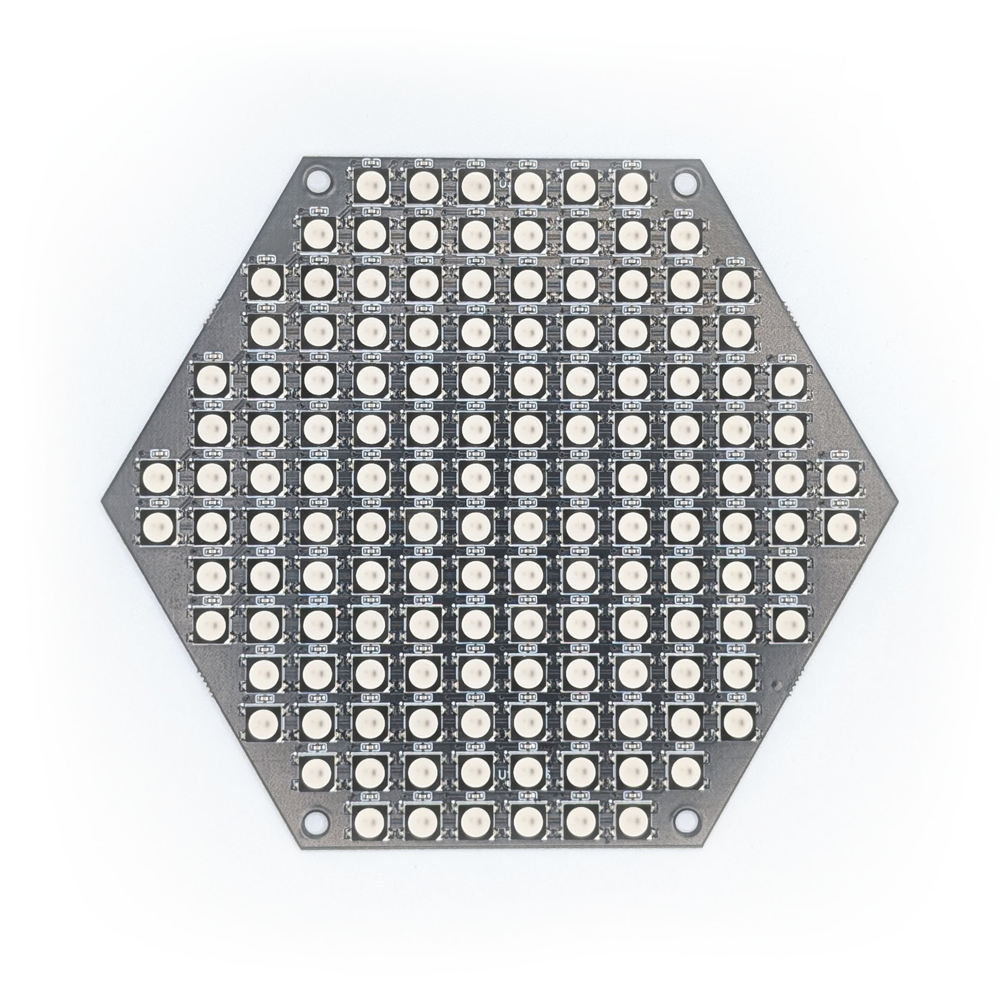
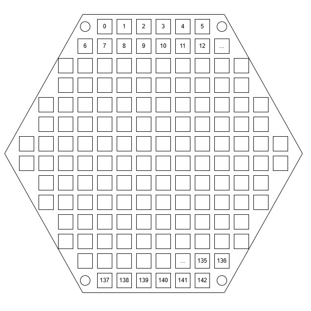

# Hexagonal LED Matrix with 144 WS2812B-B/W LEDs

Documentation and assets for the hexagonal LED matrix featuring 144 WS2812B-B/W LEDs arranged in a hexagonal pattern.

[](https://www.tindie.com/products/37170/)



## 📋 Specifications

- **Size:** 133mm diameter
- **LED Type:** WS2812B-B/W
- **Total LEDs:** 144
- **Operating Voltage:** 5V DC
- **Current Consumption:** ~60mA per LED at full brightness (~8.64A total max)
- **Data Protocol:** Single-wire serial interface (WS2812 protocol)
- **PCB Thickness:** 1.6mm
- **Mounting Holes:** 4x M3 screw holes evenly spaced around the edge
- **Connector Type:** 3-pin JST HX connector OR soldering pads, for power and data (IN and OUT)

## 🔌 Pin Configuration & Wiring

### IN Connector

| Pin | Function | Description          |
| --- | -------- | -------------------- |
| IN  | Data     | Data input signal    |
| 5V  | Power    | Power supply (5V DC) |
| GND | Ground   | Ground connection    |

### OUT Connector

| Pin | Function | Description                                  |
| --- | -------- | -------------------------------------------- |
| OUT | Data     | Data output (for chaining multiple matrices) |
| 5V  | Power    | Power supply (5V DC)                         |
| GND | Ground   | Ground connection                            |

### Wiring Diagram


## 🔢 LED Ordering

For programming patterns and animations, refer to the diagram below to understand the LED ordering within the matrix.



## 🔄 Conversion Matrix

This matrix is useful for converting 2D images stored in a standard square format to the specific layout of the LED matrix. It maps each LED's position in the matrix to its corresponding image pixel. Entries with a value of `-1` indicate positions that do not correspond to an actual LED and should be ignored.

```cpp
const short convertMat[16][14] = {
  {-1, -1, -1, -1,  0,  1,  2,  3,  4,  5, -1, -1, -1, -1},
  {-1, -1, -1,  6,  7,  8,  9, 10, 11, 12, 13, -1, -1, -1},
  {-1, -1, 14, 15, 16, 17, 18, 19, 20, 21, 22, 23, -1, -1},
  {-1, -1, 24, 25, 26, 27, 28, 29, 30, 31, 32, 33, -1, -1},
  {-1, 34, 35, 36, 37, 38, 39, 40, 41, 42, 43, 44, 45, -1},
  {-1, 46, 47, 48, 49, 50, 51, 52, 53, 54, 55, 56, 57, -1},
  {58, 59, 60, 61, 62, 63, 64, 65, 66, 67, 68, 69, 70, 71},
  {72, 73, 74, 75, 76, 77, 78, 79, 80, 81, 82, 83, 84, 85},
  {-1, 86, 87, 88, 89, 90, 91, 92, 93, 94, 95, 96, 97, -1},
  {-1, 98, 99,100,101,102,103,104,105,106,107,108,109, -1},
  {-1, -1,110,111,112,113,114,115,116,117,118,119, -1, -1},
  {-1, -1,120,121,122,123,124,125,126,127,128,129, -1, -1},
  {-1, -1, -1,130,131,132,133,134,135,136,137, -1, -1, -1},
  {-1, -1, -1,138,139,140,141,142,143,144,145, -1, -1, -1},
  {-1, -1, -1, -1,146,147,148,149,150,151, -1, -1, -1, -1},
  {-1, -1, -1, -1, -1,152,153,154,155, -1, -1, -1, -1, -1}
};
```

## 💻 Example Code

```cpp
#include <Adafruit_NeoPixel.h>

#define PIN            6  // Data pin connected to DIN of the LED matrix
#define NUMPIXELS      144 // Number of LEDs in the matrix

Adafruit_NeoPixel pixels(NUMPIXELS, PIN, NEO_GRB + NEO_KHZ800);

void setup() {
  pixels.begin(); // Initialize the NeoPixel library.
}

void loop() {
  for (int i = 0; i < NUMPIXELS; i++) {
    pixels.setPixelColor(i, pixels.Color(255, 0, 0)); // Set all LEDs to red
    pixels.show(); // Update the LED matrix
    delay(50);
  }
}
```

## 📁 Assets

- **WS2812B Datasheet:** [View Datasheet](https://cdn-shop.adafruit.com/datasheets/WS2812B.pdf)
- **Footprint:** [DXF file](./assets/hexagonal_leds_matrix_WS2812B.DXF) for the PCB layout and screw holes
- **3D Model:** [STEP file](./assets/hexagonal_leds_matrix_12x12_WS2812B.STEP) for the PCB layout and screw holes

## ⚠️ Important Considerations

- **Power Supply:** Verify that your power supply can support the total current required by the LEDs. The JST HX connectors are rated up to 3A. If you plan to use more (for example, setting the LEDs to full brightness), use the solder pads instead, with appropriately sized AWG wires.
- **LED Protection:** WS2812B require protection against voltage spikes and excessive current. [Protection Module](https://www.tindie.com/products/27407/)
- **Heat Dissipation:** Depending on your usage, active cooling may be necessary to prevent overheating.
- **Data Integrity:** To prevent signal degradation, especially in long LED chains, keep data lines as short as possible.

---

Built with ❤️ by FoxLabs

This README was generated with AI assistance.
